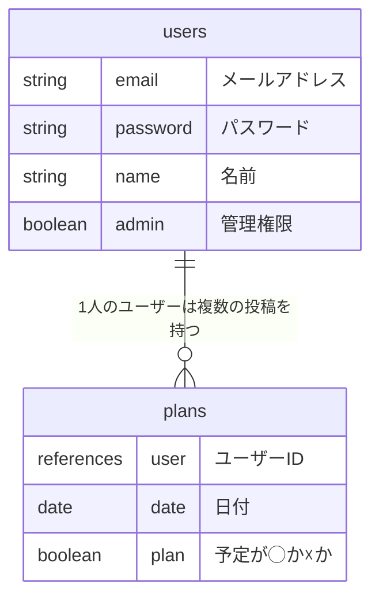
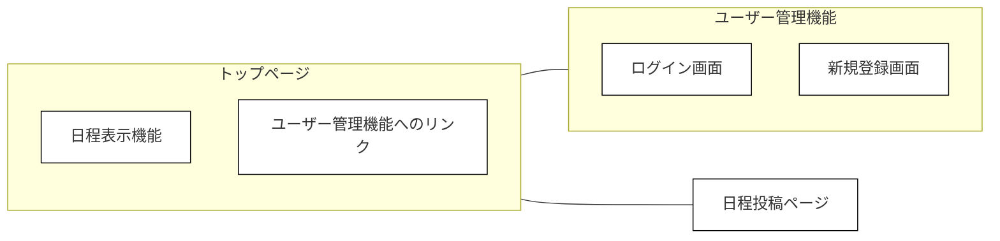

# schedule-adjustment
日程調整アプリ

# アプリケーション概要
日程調整をWebアプリ上で行える。
また、日程調整の際に起こる問題の解決を図る。

# URL
https://schedule-adjustment.onrender.com/

# テスト用アカウント
- Basic認証ID : admin
- Basic認証パスワード : 2222
- テスト用メールアドレス : aaa@aaa
- テスト用パスワード : 111111

# 利用方法
## 予定の投稿
1. サインアップページでユーザーを作成する
2. 投稿ページで自身の予定を登録する
3. トップページに予定が表示される

# アプリケーションを作成した背景
日程調整する際に、他者の予定を気にしてしまい自身の希望する予定を申告しにくい場合がある。
他者の予定を隠すことで自身の希望する予定の申告をしやすくした。

# 洗い出した要件
未記載

# 実装した機能についての画像やGIFおよびその説明
未記載

# 実装予定の機能
- ユーザー管理機能
- フロントエンドデザインの改修
- 投稿ページの改修
- 過去の予定の表示ページの実装

# データベース設計

# 画面遷移図

# 開発環境
未記載

# ローカルでの動作方法
未記載

# 工夫したポイント
未記載

# 改善点
未記載

# 制作時間
- a1（最低限の動作の実装）まで3日