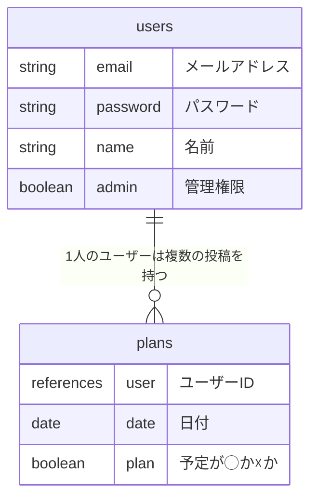
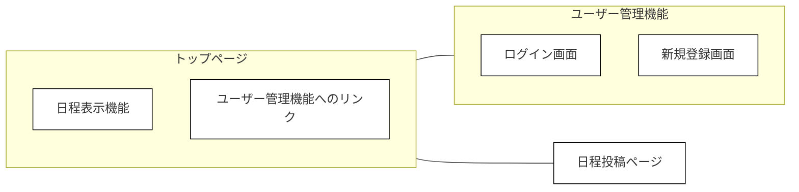

# schedule-adjustment
日程調整アプリ

# アプリケーション概要
Web上で日程調整を簡易に行うWebアプリです。
◯と✕のみの入力で、予定の都合がつくかどうかを入力します。
細かな調整には向いておらず、予定合わせの初期や、カジュアルな予定の調整などで活用できます。
## 特徴
- 入力した情報は、入力した本人以外からは確認できない。※管理者権限を持つユーザーは確認が可能
- 他者からは入力したかどうかの情報を確認できる。（入力済みの予定はチェックマークとして確認できる）
- 管理者権限を付与することができる。管理者権限を持つユーザーは自他全員の入力した予定情報を確認可能
- 自身の予定が他者に見えないこと、他者の予定が見えないことで、他者に気を使わずに予定を入力することができる
- 管理者ユーザーを設定せずに利用することが可能
- 調整において管理者に負担が集中することを避けることができる

内部の状態　※管理者ユーザーから見た状態

実際の表示

# URL
https://schedule-adjustment.onrender.com/

# テスト用アカウント
- Basic認証ID : admin
- Basic認証パスワード : 2222
- テスト用メールアドレス : aaa@aaa / bbb@bbb / ccc@ccc / ddd@ddd
- テスト用パスワード : 111111

# 利用方法
## 予定の投稿
1. サインアップページでユーザーを作成する
2. 投稿ページで自身の予定を登録する
3. トップページに予定が表示される

# アプリケーションを作成した背景
日程調整する際に、他者の予定を気にしてしまい自身の希望する予定を申告しにくい場合がある。
他者の予定を隠すことで自身の希望する予定の申告をしやすくした。

<!-- # 洗い出した要件 -->
<!-- 未記載 -->

<!-- # 実装した機能についての画像やGIFおよびその説明 -->
<!-- 未記載 -->

# 実装予定の機能
- ユーザー管理機能
- フロントエンドデザインの改修
- 投稿ページの改修
- 過去の予定の表示ページの実装

# データベース設計

# 画面遷移図

<!-- # 開発環境 -->
<!-- 未記載 -->

<!-- # ローカルでの動作方法 -->
<!-- 未記載 -->

<!-- # 工夫したポイント -->
<!-- 未記載 -->
<!--  -->
<!-- # 改善点 -->
<!-- 未記載 -->

# 制作時間
- a1（最低限の動作の実装）まで3日
